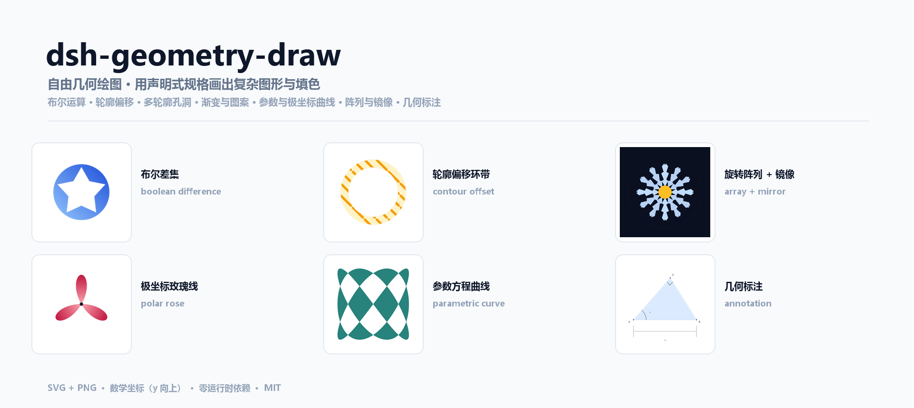
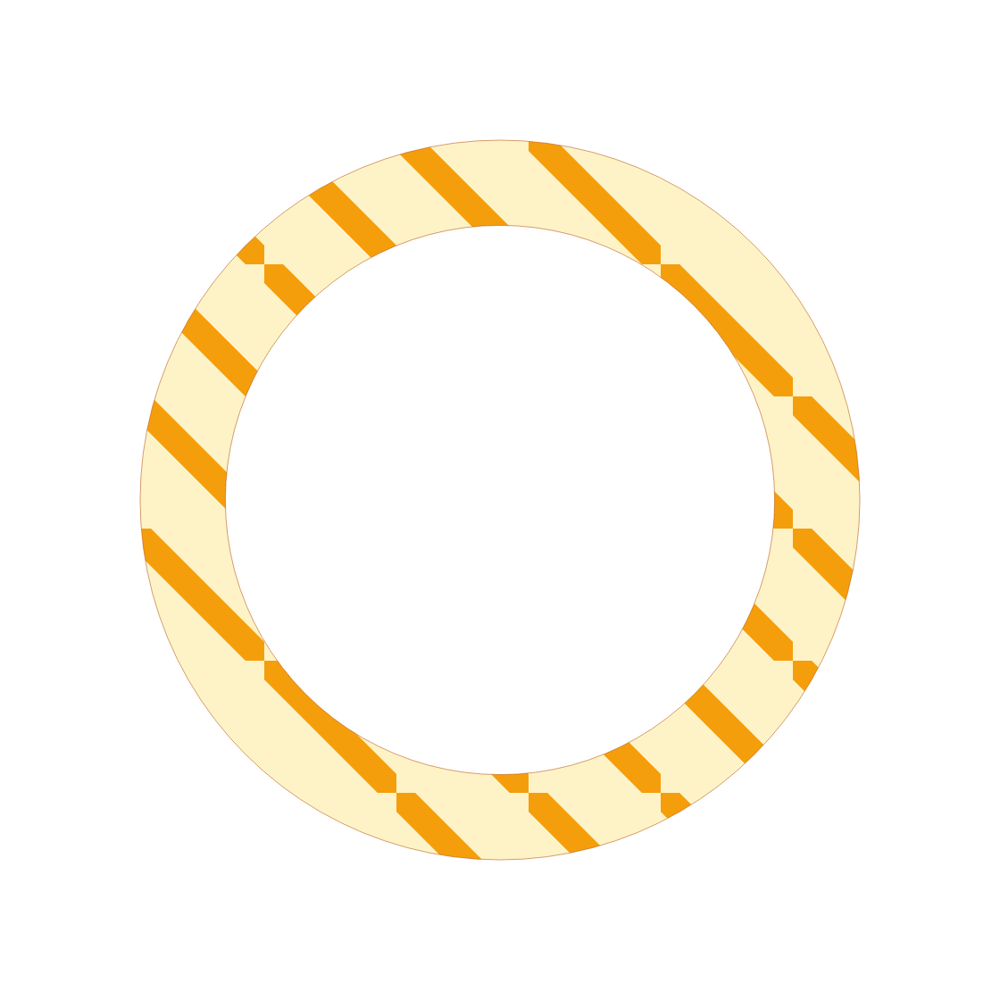
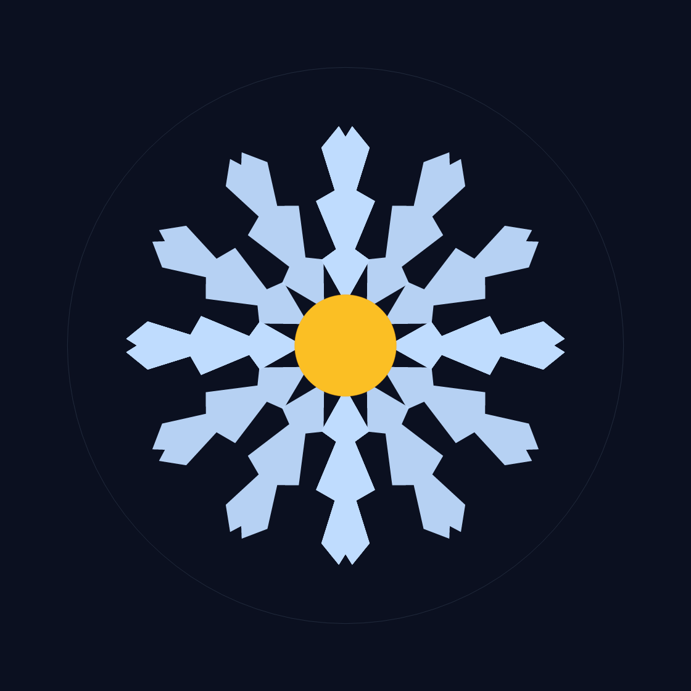
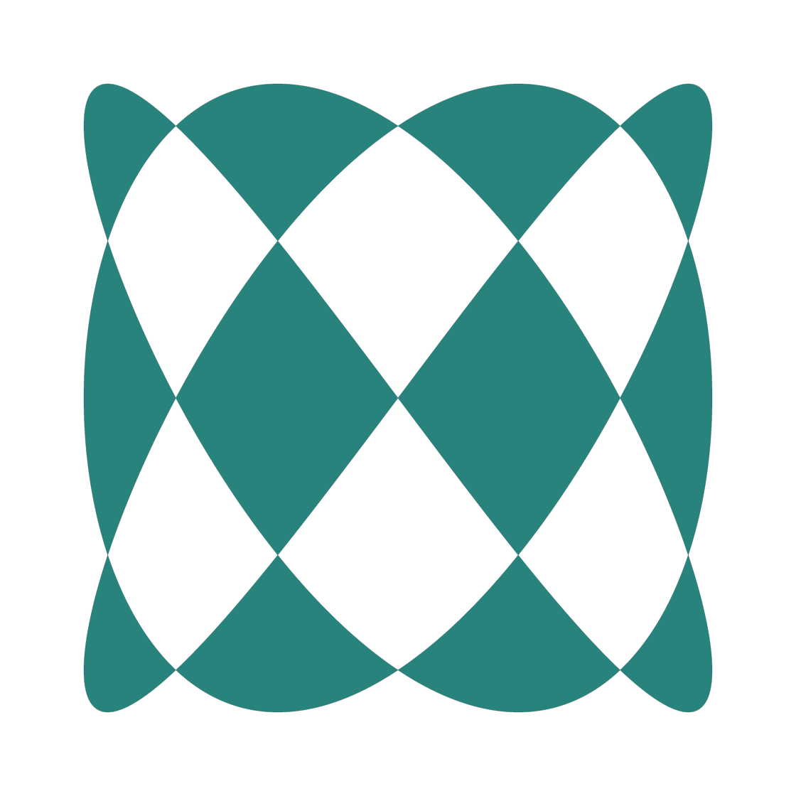
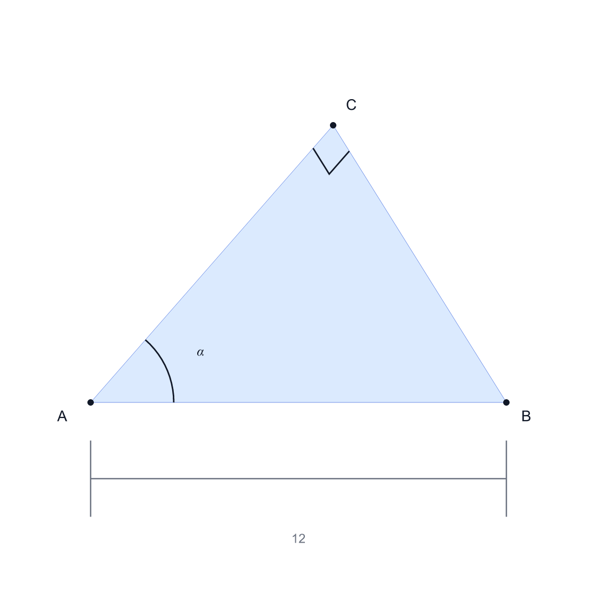

<div align="center">



# dsh-geometry-draw

**DeepSeek Harness 的自由几何绘图插件**：把一份声明式 JSON 规格编译成
自包含 SVG 与 PNG，写进会话工作区。

不是「固定图形词表」，而是把**布尔运算、轮廓偏移、真正的孔洞、渐变与图案、
参数曲线、旋转阵列、几何标注**交给一个自带的几何内核算清楚。

[](https://github.com/khfcaa/dsh-geometry-draw/actions/workflows/ci.yml)
[](LICENSE)
[](package.json)
[](#设计约束)
[](tests/geometry-test.mjs)
[](tests/tool-test.mjs)

</div>

---

## 这是什么

DSH 本身已经能画函数图（`math_figure`）。这个插件补的是**「能自由画」**那件事：

- 你画的是**区域**，不是折线：一块实心、一个洞、一圈环带，都是几何对象；
- 布尔运算是**真的**在做：`difference` 挖出来的孔洞在 SVG 里就是孔洞，
  不是拿一个白色形状盖上去糊弄缩略图；
- 轮廓偏移、阵列、镜像、渐变、图案都是**一等公民**，不用手抄 12 份坐标；
- 每个数都能写成**表达式**，且支持隐式乘法：`2x`、`3sin(t)`、`r + 0.8`。

坐标是**数学坐标**（x 向右、**y 向上**）。调用返回成品 SVG/PNG 路径与
Markdown/HTML/LaTeX 嵌入片段，外加一份**自检 warning**。

## 看一眼能画什么

<div align="center">

| | | |
|:---:|:---:|:---:|
|  |  |  |
| **布尔差集 + 线性渐变**<br><sub>圆盘挖出五角星孔洞</sub> | **轮廓偏移环带 + 图案填充**<br><sub>同一个圆外扩/内缩后相减</sub> | **旋转阵列 + 镜像**<br><sub>画一个臂，旋转复制 12 份</sub> |
|  |  |  |
| **极坐标玫瑰线**<br><sub>`r = 5.6cos(3θ)` + 径向渐变</sub> | **参数方程曲线**<br><sub>李萨如，自交且可填色</sub> | **几何标注**<br><sub>顶点 / 角弧 / 直角 / 尺寸线</sub> |

</div>

上图的 SVG 与规格在这个仓库里都是**可复现的**：
[`examples/`](examples/) 下有 6 份可直接喂给工具的 JSON 规格，
[`tools/make-examples.mjs`](tools/make-examples.mjs) 负责重新画一遍
（头图也是这么来的，见 [HEADER 图怎么做的](#头图是怎么做的)）。

## 能力

| 类别 | 支持 |
|---|---|
| **基础形状** | 矩形（可圆角）、圆、椭圆、多边形、折线、星形、任意 SVG 路径（`path.d`） |
| **布尔运算** | `union` / `intersect` / `difference` / `xor`，多操作数可嵌套 |
| **轮廓偏移** | 任意形状 `offset: ±d`：外扩得尖角，内缩过量会整体消失（有 warning） |
| **填色** | 纯色、线性/径向渐变、图案（斜线 / 网格 / 点 / 方格 / 三角 / 雪佛龙）、`evenodd` 与 `nonzero` |
| **描边** | 线宽、虚线、端点与连接样式、逐层透明度 |
| **曲线族** | `curve`（y=f(x)）、`parametric`（参数方程）、`polar`（极坐标）；在极点与定义域断点处断开 |
| **阵列与对称** | `repeat`（旋转阵列，可 `mirror_each`、可 `shrink`）、`mirror`（轴 / 角度 / 任意直线） |
| **变换** | 平移、旋转、缩放、镜像；对象式或 SVG 风格字符串；可指定 `about` 中心 |
| **标注与测量** | 顶点标签、任意文字、角弧、直角小方块、尺寸线 |
| **表达式** | 任意数值位置可写表达式：隐式乘法（`2x`、`3sin(t)`）、`pi/tau/e/phi`、常用数学函数、`vars` 复用 |
| **自检** | 渲染前报出退化轮廓、自交、填充规则隐患、内容跑出可视范围 |

## 安装

本插件是标准的 DSH bundle：用官方插件管理器安装即可（**绝对路径**指向本仓库根目录）。

```bash
# 1) 在你的 DSH 里安装（profile 名按你实际用的填：web / desktop / <自定义>）
dsh plugin --profile web install --ignore-scripts /绝对路径/dsh-geometry-draw

# 或者不走 CLI，直接改 profile 的 package.json：
#   "dependencies":  { "dsh-geometry-draw": "file:/绝对路径/dsh-geometry-draw" }
#   "dsh.profile.bundles": [ ..., "dsh-geometry-draw" ]

# 2) 确认组合里出现了它
dsh --profile web --dump-config | grep dsh-geometry-draw
```

```bash
# 3) 重启 DSH
#    bundle 只在进程启动时装载，装着的时候改 profile 不会热生效。
```

装好后会话里会多出模型可见的工具 **`geometry_draw`**，以及随包的构图技能
[`free-form-geometry`](skills/free-form-geometry/SKILL.md)。

> **桌面版用户注意**：`desktop` profile 由 Electron 应用独占管理，不能手工
> `dsh --profile desktop` 启动（会报 `managed exclusively by the Electron application`）。
> 请用应用内的插件管理入口，或在应用关闭时改 `%USERPROFILE%\.dsh\profiles\desktop\package.json`。

## 用起来

对模型说人话就行：

| 你可以说 | 会用到 |
|---|---|
| 「画一个带五角星镂空的圆盘，蓝色渐变填充」 | `boolean: difference` + 线性渐变 |
| 「画一个 12 瓣的雪花，中间一个金色圆」 | `repeat` + `mirror_each` |
| 「画玫瑰线 r = 5.6cos(3θ) 并填色」 | `polar` + 径向渐变 |
| 「把这个形状外扩 0.5 做成环带」 | `offset` + `difference` |
| 「画一个三角形，标出三个顶点和直角符号，再标出底边长度」 | `point` + `angle.right` + `dimension` |
| 「画一个圆和两个相交的矩形，取交集填橙色」 | `boolean: intersect` |

也可以直接读 [`skills/free-form-geometry/SKILL.md`](skills/free-form-geometry/SKILL.md)：
里面是构图流程、配方表、已知坑和交付前自检清单。

## 规格速览

```jsonc
{
  "width": 520, "height": 420, "background": "#ffffff",
  "xRange": [-8, 8], "yRange": [-6, 6],
  "vars": { "r": 4.4, "n": 5 },
  "elements": [
    {
      "type": "boolean", "boolean": "difference", "fill_rule": "evenodd",
      "fill": { "type": "linear", "from": [-5, 0], "to": [5, 5],
                "stops": [{ "offset": 0, "color": "#60a5fa" },
                          { "offset": 1, "color": "#1d4ed8" }] },
      "stroke": "#1e3a8a", "stroke_width": 1.4,
      "elements": [
        { "type": "circle", "center": [0, 0], "radius": "r" },
        { "type": "star", "center": [0, 0], "radius": "r + 0.8",
          "inner_radius": 2.2, "points": "n" }
      ]
    }
  ]
}
```

`elements` 里可用的元素类型与写法，见
[`src/compiler.js`](src/compiler.js)（权威定义）与 SKILL.md 的速查表。

## 输出

- `<输出目录>/<名字>.svg`：自包含、无外部引用，可直接嵌网页或再编辑。
- `<输出目录>/<名字>.png`：用宿主机已有的 `@resvg/resvg-js` 栅格化（`scale` 控像素倍数）。
- 返回值带 `markdown` / `html` / `latex` 三种现成嵌入片段，以及 `warnings` 与 `stats`。

路径是**工作区相对**的；解析后会做真实路径校验，越界或经符号链接逃出工作区的路径一律拒绝。

## 配置

写在 profile 的 patch 层：

```yaml
- id: dsh-geometry-draw
  name: dsh-geometry-draw
  config:
    outputDir: geometry     # 默认输出目录（工作区相对）
    scale: 2                # PNG 像素倍数
    background: transparent # 或任意扁平颜色
    padding: 16             # 画布内边距
    preview: false          # true 时把 PNG 附加到工具结果里（模型能看图）
```

单次调用可覆盖 `scale` / `background` / `padding` / `path` / `name` / `preview` / `audit` / `data_uri`。

## 开发

只要 Node.js **≥ 22**，没有构建步骤。

```bash
git clone https://github.com/khfcaa/dsh-geometry-draw.git
cd dsh-geometry-draw

# 可选：装上栅格化依赖，才能跑渲染类测试与重新生成示例图
npm install @resvg/resvg-js

npm test                      # 几何内核 + 工具层 + 渲染冒烟
npm run check                 # 语法检查
npm run gallery               # 重画 examples/assets/ 里的 6 张图
npm run banner                # 重新排版 docs/assets/banner.png（需要 Python + Pillow）
```

> Windows PowerShell 下如果 `npm` 报「禁止运行脚本」，用 `npm.cmd` 代替
> （执行策略限制的是 `npm.ps1` 这个包装脚本）。

单独跑：

```bash
node tests/geometry-test.mjs   # 26 项：布尔四运算、圆交叠解析解、偏移、方向规范化
node tests/tool-test.mjs       # 19 项：文件落盘、结果结构、参数校验、沙箱边界、表达式
node tests/compiler-smoke.mjs  # 4 张图：布尔 / 孔洞 / 阵列 / 标注真的渲染出来
```

`@resvg/resvg-js` 的定位是**多候选**的（[`tests/load-resvg.mjs`](tests/load-resvg.mjs)）：
独立 clone 走常规解析，作为 DSH 插件安装时则从 `DSH_PROFILE_DIR` 下的
`node_modules` 解析——因为 Node 按真实路径解析模块，插件源码目录里通常没有它。

## 项目结构

```
index.js                    # Host 半：注册 geometry_draw 工具、系统提示词、技能树、Agent 预设
cordis.patch.yml            # bundle 层：profile 列出本包时要 insert 的那一行
src/
  compiler.js               # 规格 → SVG（元素表、样式、渐变、图案、变换、阵列）
  geometry.js               # 布尔运算与轮廓偏移（自写多边形内核）
  path.js                   # SVG path 解析与展平（弧 → 三次贝塞尔）
  expr.js                   # 表达式求值（递归下降，不用 eval）
  math.js                   # 向量、法线、有向面积等几何原语
  validate.js               # 自检：退化轮廓、自交、填充规则隐患、越界
skills/free-form-geometry/  # 随包技能：构图流程、配方、已知坑、自检清单
tests/                      # 三个测试脚本 + resvg 定位器
tools/                      # 示例图与头图的生成脚本（只给维护者用）
examples/                   # 6 份可直接使用的规格 JSON + 渲染产物
```

## 设计约束

有几条是**刻意**的，提 PR 前请先读一遍：

1. **零运行时依赖。** 几何内核、表达式求值、SVG 生成全部自写；不引入 `eval`。
   栅格化复用宿主已有的 resvg（Rust 原生扩展，不随本包发布）。
2. **工具输出 schema 必须落在 DSH 的受限子集内。** `type` 只能是**单个字符串**，
   **不能写 `type: ["string", "null"]`** —— 这会在注册时抛 `JsonSchemaError`
   并让整个插件激活失败。可选字段用空字符串 / `0` 表示「无」。
3. **输出 SVG 自包含。** 不接受 `url(...)` 外部引用，不引用外部字体；
   颜色字段只接受扁平颜色。
4. **孔洞就是孔洞。** 多轮廓形状按奇偶规则解释；需要时显式写 `fill_rule`，
   绝不用「盖一个白色形状」来伪造。

## 已知限制

- 布尔运算在**直线段**上精确；曲线先按屏幕像素精度（0.1px）展平再参与运算，
  因此极端放大后曲线边界会有离散误差。
- 偏移用**顶点法**（尖角）：外扩得到尖角而非圆角；内缩超过内切半径会整体消失（会 warning）。
- 标注文字用系统字体渲染，**不是 LaTeX**。需要 LaTeX 排版时，用 `math_formula`
  出公式图片再合成。
- 随包 `skills/` 树只有在宿主能解析 `@deepseek-ai/dsh-skill-filesystem` 时才会挂载；
  挂不上不影响绘图——构图要点已内联在工具描述里。
- **写 PNG 时的一个 resvg 坑**（对使用者有影响，记在这里）：元素若同时满足
  「`opacity` 组透明度」与「包围盒退化（例如图形恰好关于圆心镜像、而圆心处没有
  实心元素）」，`@resvg/resvg-js` 会在栅格化时 panic。作图/排版脚本请改用
  `fill_opacity`（只作用于填充，不建组图层），或让图形在原点附近有实心内容。

## 头图是怎么做的

头图不是手绘的，也不是拿现成截图拼的——它是**这个插件自己画出来的**：

1. [`tools/make-examples.mjs`](tools/make-examples.mjs) 用 `src/compiler.js` 画 6 张示例图
   （2× 像素、透明背景，顺便跑一遍插件真正用的自检，要求 0 warning）；
2. [`tools/make-banner.py`](tools/make-banner.py) 用 PIL 把它们拼成 3×2 的图集并加标题。

分工是刻意的：**几何归几何引擎，排版归 PIL**。几何引擎的 `xRange` 是「内容范围」，
画布留白由 `padding` 决定，世界原点并不落在像素中心——拿它做像素级排版会一直在
跟这个偏差较劲。

## 参与

欢迎 Issue 与 PR。动手前请读 [`CONTRIBUTING.md`](CONTRIBUTING.md)：
里面写了**这个仓库真正在乎的事**（几何正确性、带判据的测试、上面那四条设计约束）。
安全问题请走 [私密渠道](SECURITY.md)，不要开公开 Issue。

## 许可证

[MIT](LICENSE) © khfcaa
